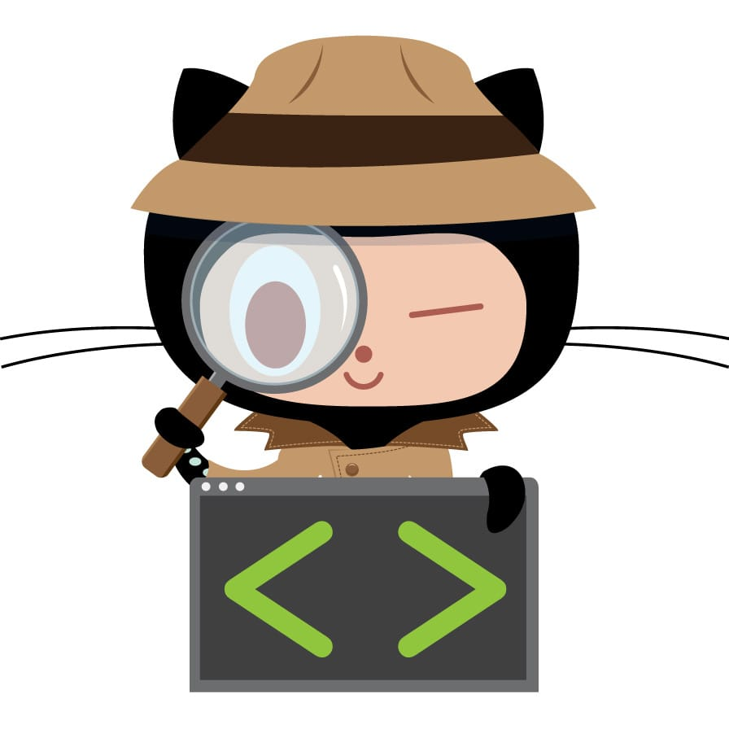

## Step 1: 에이전트에게 일을 맡긴다

Contoso 교육 포털에 개선 요청이 하나 들어왔습니다. 여러분이 직접 코드를 쓰는 대신
Copilot cloud agent 에게 맡겨 보겠습니다.

### 📖 이론: 이 단계는 준비 단계다

에이전트의 기본 동작(도우미와의 차이, 세션 로그, `copilot/*` 브랜치, 방화벽)은 카탈로그 공식 랩
[Expand your team with Copilot coding agent](https://github.com/skills/expand-your-team-with-copilot) 이 4단계로 다룹니다.
여기서 되풀이하지 않습니다.

이 랩에서 기억할 것은 한 줄입니다. **에이전트는 워크플로를 대체하지 않고 참가자로 들어옵니다.**
여러분이 이미 쓰던 브랜치, PR, 체크, 리뷰를 그대로 씁니다.
그래서 사람 기여자를 평가하던 기준을 그대로 적용할 수 있습니다. 그것이 2단계의 기여자 모델입니다.

> [!NOTE]
> Copilot cloud agent 는 유료 플랜에서만 동작합니다. 이슈에 Copilot 을 지정할 수 없다면
> 플랜과 조직 정책을 먼저 확인하세요. 아래 문제 해결을 보세요.

### ⌨️ 실습: 이슈를 Copilot 에게 할당한다

1. 이 리포지토리의 **Issues** 탭을 엽니다.

    실습이 시작될 때 이슈 몇 개가 자동으로 만들어져 있습니다.

1. `과정 목록에 난이도 배지를 추가해 주세요` 이슈를 엽니다.

1. 오른쪽 **Assignees** 에서 톱니바퀴를 누르고 **Copilot** 을 선택합니다.

    목록에 Copilot 이 보이지 않으면 아래 문제 해결을 참고하세요.

1. 할당하면 Copilot 이 👀 반응을 남기고 작업을 시작합니다.

    잠시 뒤 `copilot/` 로 시작하는 브랜치와 **draft Pull Request** 가 자동으로 생깁니다.
    에이전트가 스스로 PR 을 여는 것이지, 여러분이 만드는 것이 아닙니다.

1. 이 이슈로 돌아와 다음 단계를 기다립니다.

문제가 있나요? 🤷
 

- **Assignees 에 Copilot 이 없습니다**
  - 개인 계정이면 Copilot Pro 이상 플랜이 필요합니다. Free 로는 보이지 않습니다.
  - 조직 계정이면 관리자가 Copilot cloud agent 정책을 켜야 합니다.
  - 리포지토리 **Settings → Copilot → Cloud agent** 에서 이 리포에 대해 활성화돼 있는지 확인하세요.

- **할당했는데 아무 일도 안 일어납니다**
  - 1~2분 기다린 뒤 새로고침해 보세요. 에이전트가 리포를 읽는 데 시간이 걸립니다.
  - **Actions** 탭에서 실행 중인 작업이 있는지 확인하세요.

- **이슈가 하나도 없습니다**
  - Actions 탭에서 Step 0 워크플로가 성공했는지 확인하세요.

---
